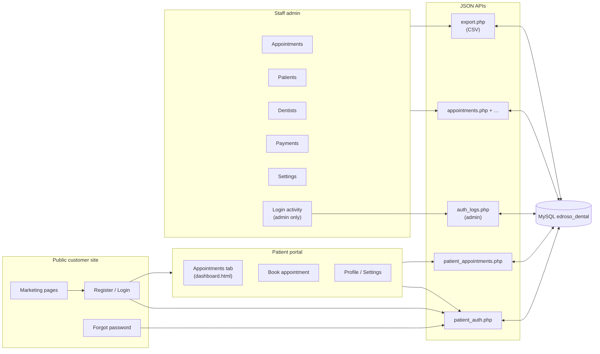

# Edroso Dental Clinic — Management System

Full-stack **PHP + MySQL** web application for clinic staff and patients: admin workflows, public marketing site, and a logged-in **patient portal** (register, book, view/cancel appointments).

### Changelog (2026-05-19)

This release adds **CSV exports**, **date-range payment filtering**, role-aware **Login activity**, and a refreshed **patient portal** (renamed Appointments tab, standardized layout, past-appointment detail modal).

| Area | What changed |
|------|----------------|
| **CSV exports** | New **`api/export.php`** + **`includes/export_helpers.php`** stream filtered CSVs. **`downloadExport(params)`** in **`assets/js/app.js`** drives the buttons. **Dashboard** (`admin/dashboard.html`) → **Export summary** (admin only) and per-status **Export CSV** on the Appointment Overview. **Appointments** (`admin/appointments.html`) → **Export** button respects the active tab (today / upcoming / completed / cancelled / picked day), dentist filter, and search. **Payments** (`admin/payments.html`) → **Export CSV** mirrors the active status, search, and **date range**; the export endpoint is **admin-only** (`sessionUserRole()` check) and the button is hidden for staff. |
| **Payments date range** | `admin/payments.html` gains **From / To** date inputs and a **Clear** button. **`api/payments.php`** GET accepts `from` / `to` and applies them to both the list and the **stats** strip via `COALESCE(payment_date, DATE(created_at))`. Export filename embeds the range (e.g. `payments_from_2026-05-01_to_2026-05-18_….csv`). |
| **Login activity → admin only** | **`api/auth_logs.php`** now uses **`requireAdminSession()`** (403 for staff). **`assets/js/layout.js`** hides the **Login activity** sidebar link unless `window.__edrosoStaffRole === 'admin'`. **`assets/js/app.js` `checkAuth()`** exposes the role and re-renders the sidebar so staff never see (or keep) the entry after login. **`admin/auth-logs.html`** redirects staff to `dashboard.html` if they hit the URL directly. |
| **Logout (admin & staff) fix** | `assets/js/app.js` switched the **`#logoutButton`** click handler to **event delegation** on `document`. The previous direct binding was wiped when `checkAuth()` re-rendered the sidebar to apply the role-aware Login activity link; delegation survives any sidebar re-render. |
| **Customer portal — tab rename + centering** | **Dashboard → Appointments** (label and `<title>` only; **filename `dashboard.html` is preserved** so existing redirects from `confirmation.html`, `register.html`, `login.html`, and `app.js` keep working). Tab strip is now centered (`justify-center`), wider (`px-6 sm:px-8 py-4`), larger (`text-base sm:text-lg font-semibold`), and uses `border-b-2` with stronger hover background. **`customer-site/portal/assets/js/portal-tabs.js`** updated to match. All three portal pages (`profile.html`, `dashboard.html`, `settings.html`) share the same `<main class="mx-auto max-w-4xl px-4 py-8 sm:px-6 sm:py-10">` wrapper; Settings’ two cards no longer cap at `max-w-lg`. |
| **Past appointments detail modal (portal)** | Each past row in **`customer-site/portal/dashboard.html`** is now a clickable button (`cursor-pointer`) carrying `data-patient`, `data-dentist`, `data-service`, `data-date`, `data-time`, `data-status`, `data-notes`. New modal element + delegated click handler opens with fade + scale animation; closes via **✕**, **Close**, backdrop click, or **Escape**. Missing fields render **N/A**. **`api/patient_appointments.php`** adds **`notes`** to admin-mirror list rows so the modal can show notes for both portal-side and staff-created appointments. |
| **Marketing nav polish (prior in series)** | “Back to site” link on **`customer-site/login.html`** and **`register.html`**; the **Book** CTA (`customer-site/assets/js/booking-cta.js`) sends logged-out users to **login** (not register); **`customer-site/services.html`** drops the per-card payment-method pills. |
| **Admin UX cleanup (prior in series)** | Payment receipt print layout refreshed in **`admin/payments.html`** (teal header, card layout, badges, totals, thank-you footer). **`admin/settings.html`** replaces native `confirm()` / `prompt()` for service add/delete with a styled **Add service** modal and the shared **`confirmDialog(message, { title, confirmLabel })`** in `assets/js/app.js`. Add-service validation rejects empty submissions with inline messages. |
| **Booking — past date/time guards (prior in series)** | **`includes/booking_datetime.php`** adds Manila-timezone helpers (`is_past_date`, `is_past_time`). **`includes/availability_slots.php`** marks past slots `available: false, past: true`. **`api/patient_appointments.php`** + **`api/availability.php`** reject past dates/times with explicit errors. **`customer-site/portal/assets/js/book.js`** disables past slots client-side (`.slot-pill--past`) with cache-busted CSS/HTML. |
| **`add_appointment_indexes.sql`** | Header clarifies it is **legacy-only** — the same indexes already ship in **`sql/database.sql`** and **`sql/patient_appointments.sql`**. |

Runtime upload directories (gitignored or local): **`assets/uploads/payment_qr/`**, **`assets/uploads/portal_gcash/`**.

### Changelog (2026-05-11)

This release aligns **staff admin**, **APIs**, **portal booking**, and **documentation** with the current tree. Highlights:

| Area | What changed |
|------|----------------|
| **Core schema location** | Primary import file is **`sql/database.sql`** (root `database.sql` removed). Fresh installs should import that file first. |
| **`includes/db.php`** | Optional **`includes/config.php`** can define `DB_*` and `APP_ENV`. Sessions use **strict mode** and tightened cookie params (`Secure` when HTTPS, `SameSite=Lax`, `HttpOnly`). JSON APIs send **same-host CORS** (`Access-Control-Allow-Origin` only when `Origin` matches the request host) with credentials, plus security headers and **OPTIONS** handling. |
| **Staff credential recovery** | **`api/auth.php`**: `staff_recovery_request` / `staff_recovery_reset` — OTP-based **forgot password** (by username) and **forgot username** (by unique staff full name), rate-limited, **staff role only**. Creates **`credential_recovery_challenges`** and writes **`admin_staff_alerts`** rows (schema ensured on use). **`admin/login.html`** exposes the recovery UI. Optional SQL: **`sql/upgrade_staff_recovery_alerts.sql`** (also seeds demo user `staff` / `password` if missing). |
| **Login audit log** | **`includes/auth_login_log.php`** — append-only **`auth_login_log`** (realms `staff` / `portal`) with IP and user agent; table auto-created on first log attempt. Staff and portal logins call **`log_auth_login_attempt`**. **`api/auth_logs.php`** lists entries for logged-in staff (`?realm=` filter). **`admin/auth-logs.html`** + sidebar **Login activity** (`assets/js/layout.js`). Reference DDL: **`sql/auth_login_log.sql`**. |
| **In-app staff alerts** | **`api/admin_alerts.php`** — list unread/read **`admin_staff_alerts`**, mark read (CSRF on POST). **Dashboard** (`admin/dashboard.html`) can surface recent alerts. |
| **Admin layout** | **`assets/css/style.css`** + **`assets/js/app.js`**: fixed sidebar vs main column (Chrome flex), header **z-index** above sidebar, desktop **`admin-sidebar-collapsed-desktop`**, deferred **`setTimeout(0)`** second **`initSidebar()`** pass, **`window.initAdminSidebar()`** for late-injected chrome. See **Admin shell** under Tech stack. |
| **Appointments (staff)** | **`api/appointments.php`**: optional columns **`internal_change_reason`** / **`slot_modified_at`**; staff edits that change slot sync linked **portal** rows; conflict helpers; session-scoped **portal→admin backfill** via **`includes/portal_admin_sync.php`**. **`assets/js/appointments.js`** + **`admin/appointments.html`**: summary stat cards act as **list filters** (today / upcoming / completed / cancelled). |
| **Portal booking & payments** | **`api/patient_appointments.php`** + **`sql/patient_appointments.sql`**: **`payment_reference`**, **`payment_proof_path`**, staff metadata columns; **GCash proof** upload (`?action=upload_gcash_proof`), transactional booking paths, stricter GCash validation where configured. **`customer-site/portal/book.html`**, **`book.js`**, **`dashboard.html`** updated for the flow. |
| **Clinic / portal settings** | **`api/settings.php`**: admin **cashless payment QR** upload/clear (`upload_cashless_payment_qr`, `clear_cashless_payment_qr` → **`assets/uploads/payment_qr/`**), **`portal_referral_sources`**, **`auto_logout_minutes`** (surfaced on `auth.php?action=me`). **`api/portal_options.php`** exposes **`cashless_payment_qr_path`** and referral list to the portal. **`admin/settings.html`** extended for new controls. |
| **Other API / UI** | **`api/dashboard.php`**, **`api/backup.php`**, **`api/payments.php`**, **`api/services.php`**, **`api/patient_auth.php`** — incremental fixes. **`includes/portal_booking_mirror.php`** — small sync adjustments. Marketing **`login.html` / `register.html` / `service.html` / `services.html`** — minor link or copy tweaks. |
| **Performance (legacy SQL)** | **`sql/add_appointment_indexes.sql`** — same date/status indexes as in **`sql/database.sql`** and **`sql/patient_appointments.sql`**; only for **old** DBs missing them (skip on fresh installs). |

Runtime upload directories (gitignored or local): **`assets/uploads/payment_qr/`**, **`assets/uploads/portal_gcash/`**.

---

## How the system fits together



**Two audiences, one database**

| Audience | Where they work | Auth |
|----------|-----------------|------|
| **Staff** | `admin/*.html` + root `api/` (except portal-specific JSON) | `api/auth.php` → `users` table, session keys for staff |
| **Patients** | `customer-site/` (marketing + `portal/`) | `api/patient_auth.php` → `portal_users`, session keys `portal_user_*` |

Portal bookings live in **`patient_appointments`** and can be **mirrored** into the main **`appointments`** table for the desk calendar (see `includes/portal_booking_mirror.php`). When a portal user matches an admin **`patients`** row (by email), the portal **dashboard** also lists that patient’s **staff-created** appointments (same date/time as a portal row are deduplicated so nothing shows twice).

---

## End-to-end flows

### Staff day-to-day

1. Open **Admin login** → session created (optional **forgot password / username** recovery for **staff** accounts via OTP on the login page).
2. **Dashboard** — quick stats, recent activity, and **staff alerts** when credential recovery or similar events occur. Admins also get an **Export summary** button on the welcome banner and a per-status **Export CSV** on the Appointment Overview funnel.
3. **Appointments** — create/edit/cancel; filter by dentist; **click stat cards** to filter by today / upcoming / completed / cancelled; **Export CSV** mirrors the visible filters.
4. **Patients / Dentists / Payments / Settings** — maintain master data and clinic settings. **Payments** has a **From / To** date range and an admin-only **Export CSV** that follows the active filters.
5. **Login activity** — admin-only audit of staff + portal sign-in attempts (the link is hidden from the staff sidebar; direct URL access redirects to the dashboard).

### Role differences (admin vs staff)

| Capability | Admin | Staff |
|------------|:-----:|:----:|
| Dashboard / Appointments / Patients / Dentists / Payments / Settings | Yes | Yes |
| Login activity (sidebar + page) | Yes | **Hidden / 403** |
| Dashboard summary CSV (`api/export.php?resource=dashboard_summary`) | Yes | Hidden |
| Payments CSV (`api/export.php?resource=payments`) | Yes | **Hidden / 403** |
| Appointments CSV (`api/export.php?resource=appointments`) | Yes | Yes |
| Cashless QR upload, certain settings sections | Yes | Restricted (see `staff-settings-restricted`) |

### CSV exports

All exports stream straight from MySQL via **`api/export.php`** (helpers in **`includes/export_helpers.php`**) and are triggered from the UI through **`downloadExport(params)`** in `assets/js/app.js`. Every endpoint requires a valid staff session; `payments` and `dashboard_summary` additionally require the **admin** role.

| Resource | Query params | Where it’s used | Role |
|----------|--------------|-----------------|------|
| `appointments` | `status` (`today` \| `upcoming` \| `completed` \| `cancelled` \| `all`), `date`, `dentist_id`, `search` | `admin/appointments.html` **Export** button (mirrors active tab + filters); `admin/dashboard.html` per-status **Export CSV** on the Appointment Overview | Staff + Admin |
| `payments` | `status` (`all` \| `paid` \| `pending` \| `overdue`), `from`, `to`, `search` | `admin/payments.html` **Export CSV** (uses the visible date range and search) | **Admin only** |
| `dashboard_summary` | `range` (e.g. `today`, `week`, `month`) | `admin/dashboard.html` **Export summary** button on the welcome banner | **Admin only** |

Filenames embed the active filters where useful, e.g. `payments_from_2026-05-01_to_2026-05-18_paid_….csv`. The staff sidebar / UI hides admin-only buttons automatically via `window.__edrosoStaffRole`.

### Patient: discover → account → book

1. Browse **`customer-site/`** (home, services, contact). Footer/clinic text can be driven by **`api/settings.php?public=1`** (see `customer-site/assets/js/main.js`). The **Book** CTA sends logged-out users to **login** (with `?next=` so they land on `portal/book.html` after sign-in).
2. **Register** (`register.html`) → `portal_users` (+ optional mirror row in `patients`). Marketing **login** and **register** pages have a **Back to site** link.
3. **Login** → portal session.
4. **Book** (`portal/book.html`) → `patient_appointments` (pending/scheduled). Availability comes from dentist schedules and existing bookings; **past dates/times are blocked** both client- and server-side (Manila timezone via `includes/booking_datetime.php`).
5. **Appointments tab** (`portal/dashboard.html`) — upcoming + past + cancelled; cancel eligible rows via API. Admin bookings for the same person are merged when email matches **`patients`**. Each **past row is clickable** and opens a detail modal (patient, dentist, service, date, time, status, notes; **N/A** when missing). The modal closes via **✕**, **Close**, backdrop, or **Escape**.

### Patient: password recovery (no real email required)

1. **Forgot password** (`customer-site/forgot-password.html`):
   - **Continue with security question** — if the account has a saved question (`portal_users.recovery_question` / hashed answer), the user sees the question and sets a **new password** after answering.
   - **Email me a code** — legacy path: 6-digit token in **`reset_tokens`** + PHP `mail()` (useful when SMTP works).
2. **Reset password** (`customer-site/portal/reset-password.html`) — same two modes in one page (tabs).
3. **While logged in** — **Portal → Settings** can set or change the security question (requires **current password**).

Optional **security question at registration** (`register.html`): recommended for local/dev when email is not reliable. Answers are normalized (case/spacing) and stored with **`password_hash`**.

---

## Project structure

```
edroso-dental-system/
├── admin/                      ← Staff UI (login, dashboard, appointments, auth-logs, …)
├── api/
│   ├── auth.php                ← Staff login / session / recovery / me (auto_logout)
│   ├── auth_logs.php           ← Admin-only: login audit log (JSON)
│   ├── admin_alerts.php        ← Staff: in-app alerts
│   ├── export.php              ← Staff/admin: CSV exports (appointments, payments [admin], dashboard_summary [admin])
│   ├── patient_auth.php        ← Portal register / login / logout / forgot / reset / recovery
│   ├── patient_appointments.php ← Portal bookings, lists, cancel, availability, GCash proof
│   ├── appointments.php        ← Staff appointments API
│   ├── portal_options.php      ← Public portal booking options (payments, QR path, referrals)
│   ├── patients.php, dentists.php, payments.php, dashboard.php, settings.php, …
│   └── …
├── assets/                     ← Staff app JS/CSS
├── customer-site/              ← Public site + patient portal
│   ├── index.html, about.html, services.html, contact.html, …
│   ├── login.html, register.html, forgot-password.html
│   ├── assets/                 ← customer-site CSS/JS/images + booking-cta.js, main.js
│   └── portal/
│       ├── dashboard.html      ← Appointments tab (filename kept for redirects)
│       ├── book.html, profile.html, settings.html
│       ├── confirmation.html, reset-password.html
│       └── assets/js/portal-tabs.js  ← Tab active-state styling
├── includes/                   ← db.php, config.php (optional), csrf.php, auth_login_log.php, booking_datetime.php, availability_slots.php, export_helpers.php, portal mirror/sync helpers
├── sql/
│   ├── database.sql            ← Core clinic schema (run first)
│   ├── portal_users.sql        ← portal_users (run after core DB)
│   ├── portal_recovery_columns.sql ← optional manual ALTER for recovery columns
│   ├── patient_appointments.sql
│   ├── auth_login_log.sql      ← optional manual CREATE for login audit table
│   ├── upgrade_staff_recovery_alerts.sql ← staff OTP recovery + admin_staff_alerts + demo staff user
│   ├── upgrade_edroso_features.sql, upgrade_tc063_payment_method.sql, …
│   └── add_appointment_indexes.sql
├── tools/                      ← e.g. sync_portal_to_admin.php
├── .gitignore
└── README.md
```

---

## Installation

### Requirements

- **PHP** 7.4+ (8.x recommended)
- **MySQL** 5.7+ or MariaDB 10.3+
- **Apache** with PHP (XAMPP / WAMP / Laragon)

### Step 1 — Core database

1. Open **phpMyAdmin** → **Import** → **`sql/database.sql`** → **Go**  
2. Creates `edroso_dental`, staff tables, and sample data where included.

### Step 2 — Patient portal tables

On database **`edroso_dental`**, in order:

1. `sql/portal_users.sql` — patient accounts (`portal_users`)
2. `sql/patient_appointments.sql` — portal booking rows

`api/patient_auth.php` and `api/patient_appointments.php` can **auto-create** missing tables/columns on first use; the SQL files are still the clean reference for fresh installs.

Optional: `sql/portal_recovery_columns.sql` — only if you prefer to add **`recovery_question`** / **`recovery_answer_hash`** manually (otherwise the API adds them).

Optional: `sql/auth_login_log.sql` — manual **`auth_login_log`** table (otherwise created on first staff/portal login attempt).

Optional: `sql/upgrade_staff_recovery_alerts.sql` — **`credential_recovery_challenges`**, **`admin_staff_alerts`**, and demo **`staff`** user (`password`) for testing OTP recovery.

Other `sql/upgrade_*.sql` files apply optional schema tweaks; read each file’s comments before running.

### Step 3 — Configure database access

Either add **`includes/config.php`** defining `DB_HOST`, `DB_USER`, `DB_PASS`, `DB_NAME`, and optional `APP_ENV`, **or** rely on the fallbacks in **`includes/db.php`**:

```php
define('DB_HOST', 'localhost');
define('DB_USER', 'root');
define('DB_PASS', '');
define('DB_NAME', 'edroso_dental');
```

Keep secrets out of Git (`.env` is ignored if you introduce one); do not commit real production passwords.

### Step 4 — Deploy

**XAMPP example:** `C:/xampp/htdocs/edroso-dental-system/`

### Step 5 — Useful URLs

| Area | Example URL |
|------|----------------|
| Staff login | `http://localhost/edroso-dental-system/admin/login.html` |
| Admin login activity (admin only) | `…/admin/auth-logs.html` |
| CSV exports (admin / staff) | `…/api/export.php?resource=appointments\|payments\|dashboard_summary&format=csv` |
| Customer home | `http://localhost/edroso-dental-system/customer-site/index.html` |
| Register | `…/customer-site/register.html` |
| Login | `…/customer-site/login.html` |
| Forgot password | `…/customer-site/forgot-password.html` |
| Reset password (code or security answer) | `…/customer-site/portal/reset-password.html` |
| Portal **Appointments** tab | `…/customer-site/portal/dashboard.html` |
| Book (requires login) | `…/customer-site/portal/book.html` |
| Portal settings (password + security question) | `…/customer-site/portal/settings.html` |

---

## Default staff login

| Username | Password   | Role  |
|----------|------------|-------|
| `admin`  | `password` | Admin |
| `staff`  | `password1` | Staff |

If you ran **`sql/upgrade_staff_recovery_alerts.sql`**, a demo **`staff`** / **`password`** user may also exist for reception-style testing.

Change passwords in production.

---

## Features (staff app)

| Module | Features |
|--------|----------|
| **Dashboard** | Stats, funnel, recent appointments; staff **alerts** strip; **Export summary** + per-status **Export CSV** (admin) |
| **Patients** | CRUD, search, filters, pagination |
| **Appointments** | List/calendar, CRUD, dentist filters; **stat-card filters**; portal row sync on slot edits; **Export CSV** follows the active filters |
| **Dentists** | Profiles, photos, schedules |
| **Payments** | CRUD, stats, status + **date range (From / To)** filters; **Export CSV** (admin only, range-aware filename) |
| **Settings** | Clinic configuration; **Add service** modal with validation; **cashless QR** upload (custom confirm dialogs); portal referral list; session **auto-logout** minutes |
| **Login activity** | **Admin-only** read-only audit of staff + portal sign-in attempts (`api/auth_logs.php`) |
| **Auth** | Session-based staff login via `api/auth.php`; **OTP recovery** for staff; login **audit log**; logout button uses **event delegation** so it survives sidebar re-renders |
| **Exports** | CSV via `api/export.php` — `appointments` (staff/admin), `payments` (admin, status + range + search), `dashboard_summary` (admin) |

---

## Patient portal and customer site

### Registration and login

- **`customer-site/register.html`** → `api/patient_auth.php` (`action: register`). Optional **`recovery_question`** / **`recovery_answer`** for non-email password reset.
- **`customer-site/login.html`** → `action: login`. Sets `$_SESSION['portal_user_id']` and `portal_user_name`.
- Session path is configured in **`includes/db.php`** so `customer-site/` and `api/` share the same origin cookie.

**Login redirect:** `login.html?next=portal/book.html` — after login, redirect to a path under `customer-site/` (validated in client/server patterns such as `portal/*.html`).

### Booking and the Appointments tab

- **`portal/book.html`** — date/time/dentist, submits to **`api/patient_appointments.php`** (JSON). Requires portal session. When **GCash** is selected, the flow can require a **reference** and/or **proof-of-payment** upload (`upload_gcash_proof`), depending on clinic options. **Past dates and past times are blocked** client-side (`book.js`) and rejected server-side via `includes/booking_datetime.php` (Manila timezone).
- **`portal/dashboard.html`** (now labeled **Appointments** in the navigation) — lists portal rows + matching staff appointments; cancel where allowed. **Past rows are clickable** and open a **detail modal** populated from `data-*` attributes (patient, dentist, service, date, time, status, **notes**; missing values render as **N/A**). The modal supports fade + scale animation and closes via **✕**, **Close**, backdrop, or **Escape**. Admin-mirrored rows include the `notes` column (see `admin_appointment_to_portal_list_row()` in `api/patient_appointments.php`).
- **Tab styling** — Profile / Appointments / Settings tabs are centered (`justify-center`) and enlarged (`px-6 sm:px-8 py-4`, `text-base sm:text-lg font-semibold`, `border-b-2`); active state managed by `customer-site/portal/assets/js/portal-tabs.js`. All three portal pages share the same `max-w-4xl` `<main>` wrapper.

### Password and recovery (`api/patient_auth.php`)

| Action / route | Purpose |
|-----------------|--------|
| `GET ?action=csrf` | CSRF token for POST bodies |
| `GET ?action=me` | Logged-in portal user profile (+ `has_recovery_question`, `recovery_question` text) |
| `POST` `register` | New `portal_users` row |
| `POST` `login` / `logout` | Session |
| `POST` `change_password` | Logged-in; needs current password |
| `POST` `update_recovery` | Logged-in; set/change security question + answer |
| `POST` `recovery_challenge` | Email → returns security **question** if configured |
| `POST` `forgot_password` | Creates 6-digit **`reset_tokens`** row + sends `mail()` |
| `POST` `reset_password` | New password + either **`token`** (email code) or **`recovery_answer`** |

### Booking CTAs on the marketing site

- **`customer-site/assets/js/booking-cta.js`** — `[data-book-cta]`: checks `POST patient_auth.php` `{ action: "me" }`, then routes to book flow or login with `next=`.

### APIs (patient) — summary

| File | Role |
|------|------|
| `api/patient_auth.php` | Auth, profile, password, recovery, CSRF; writes **`auth_login_log`** on portal login |
| `api/patient_appointments.php` | Availability, create booking, list by status, cancel; GCash proof upload; merges admin appointments for linked patients (admin-mirror rows now include `notes` for the past-appointment modal) |
| `api/auth_logs.php` | **Admin-only** (`requireAdminSession`): paginated **`auth_login_log`** (`?realm=staff` \| `portal`) |
| `api/admin_alerts.php` | Staff: list / mark-read **`admin_staff_alerts`** |
| `api/export.php` | Staff/admin CSV streaming (delegates to `includes/export_helpers.php`); `payments` and `dashboard_summary` are admin-only |
| `api/portal_options.php` | Public (no staff session): payment methods, referral sources, optional **cashless QR** path for booking UI |

---

## Tech stack

- **Staff & customer UI:** HTML5, Tailwind CDN, vanilla JS, Inter (customer site)
- **Backend:** PHP + MySQLi, JSON `respond()` APIs
- **Auth:** PHP sessions — separate session keys for staff vs portal

### Admin shell (layout & sidebar)

Staff pages under `admin/` share a fixed **sidebar** (`#sidebar`) and **main column** (`#main-content`) with a top bar (`#mainHeader`) and hamburger control (`#sidebar-toggle`). Layout is **Tailwind classes + extra rules** in `assets/css/style.css` so Chrome/Edge flex behavior stays predictable (for example `min-w-0` on the main column where needed).

- **Desktop:** The menu button toggles **`body.admin-sidebar-collapsed-desktop`**. CSS ensures the sidebar can slide fully off-screen even when Tailwind’s `md:translate-x-0` would otherwise win.
- **Mobile (narrow viewports):** The same button opens/closes a drawer; **`#sidebarBackdrop`** closes the drawer when tapped.
- **Stacking:** The header is given a higher stacking order than the fixed sidebar so the hamburger stays clickable when panels overlap during transitions.

**JavaScript (`assets/js/app.js`):** `initSidebar()` wires the toggle, resize behavior, and initial widths. It only sets `document.body.dataset.adminSidebarBound` after both `#sidebar` and `#main-content` exist, so a first pass that runs before the DOM is ready does not “lock” a broken state. A **`setTimeout(..., 0)`** after `DOMContentLoaded` runs `initSidebar()` again if binding never completed (for example when another script injects the chrome in its own `DOMContentLoaded` handler). If you inject sidebar/header **later** (e.g. after `fetch`), call **`window.initAdminSidebar()`** once right after the HTML is in the document.

---

## Troubleshooting

**Database connection failed**  
Check `includes/db.php` and that MySQL is running.

**Blank page / 404 on API**  
Use `http://localhost/.../api/...` (not `file://`). Confirm Apache document root includes the project.

**Staff login does not work**  
Cookies enabled; use `http://localhost/...`.

**Portal register/login fails**  
Ensure `portal_users` exists. Check the browser **Network** tab for JSON errors.

**Booking fails**  
Ensure `patient_appointments` exists and the user is logged in on the **same origin** as `api/`.

**Forgot password / email code never arrives**  
PHP `mail()` depends on server SMTP; use **security question** path or configure mail for your host.

**Security question missing on forgot flow**  
User must set it at **register** or in **Portal → Settings** while logged in.

**Access denied (MySQL)**  
Grant privileges, e.g. `GRANT ALL ON edroso_dental.* TO 'root'@'localhost';`

**Admin sidebar overlaps content or hamburger does nothing**  
Hard-refresh the staff page (`Ctrl+F5`) so `assets/css/style.css` and `assets/js/app.js` reload. Confirm the page includes both `#sidebar` and `#main-content`. If the shell is injected asynchronously, call `window.initAdminSidebar()` after injection.

**Logout button does nothing after the sidebar re-renders**  
Hard-refresh once so `assets/js/app.js` reloads. The handler now uses **event delegation** on `document` (`#logoutButton`), so it should survive `checkAuth()` re-renders. If a custom page replaces the sidebar wholesale, ensure the new markup still contains an element with `id="logoutButton"`.

**Login activity link still visible for a staff account**  
`assets/js/app.js`’s `checkAuth()` decides visibility based on `window.__edrosoStaffRole`. Log out and back in so the role flag is set before `assets/js/layout.js` rebuilds the sidebar. Direct visits to `admin/auth-logs.html` redirect non-admins to the dashboard.

**Payments export returns 403**  
Only admin sessions can export `payments` and `dashboard_summary`. Use an admin account or hit `?resource=appointments` instead.

---

## Security notes

- Security questions are **convenience** recovery for dev/low-email environments; they are weaker than email/SMS MFA. Harden for production as needed.
- Rate limiting on **answer-based** reset: repeated wrong answers block further attempts for a short period (see `patient_auth.php`).
- Never commit real **`.env`**, database passwords, or production keys (`.gitignore` already excludes `.env`).
