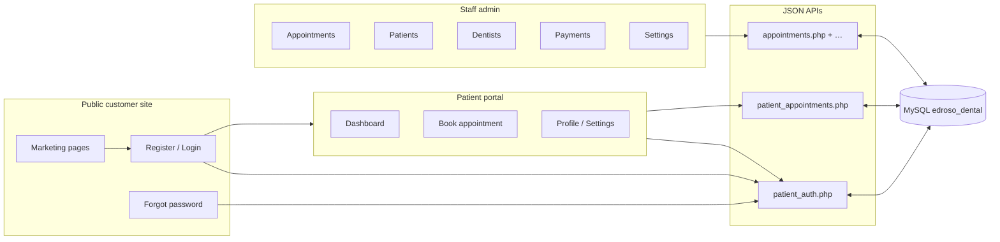

# Edroso Dental Clinic — Management System

Full-stack **PHP + MySQL** web application for clinic staff and patients: admin workflows, public marketing site, and a logged-in **patient portal** (register, book, view/cancel appointments).

---

## How the system fits together



**Two audiences, one database**

| Audience | Where they work | Auth |
|----------|-----------------|------|
| **Staff** | `admin/*.html` + root `api/` (except portal-specific JSON) | `api/auth.php` → `users` table, session keys for staff |
| **Patients** | `customer-site/` (marketing + `portal/`) | `api/patient_auth.php` → `portal_users`, session keys `portal_user_*` |

Portal bookings live in **`patient_appointments`** and can be **mirrored** into the main **`appointments`** table for the desk calendar (see `includes/portal_booking_mirror.php`). When a portal user matches an admin **`patients`** row (by email), the portal **dashboard** also lists that patient’s **staff-created** appointments (same date/time as a portal row are deduplicated so nothing shows twice).

---

## End-to-end flows

### Staff day-to-day

1. Open **Admin login** → session created.
2. **Dashboard** — quick stats and recent activity.
3. **Appointments** — create/edit/cancel; filter by dentist; list ties to `appointments` + patients + dentists.
4. **Patients / Dentists / Payments / Settings** — maintain master data and clinic settings.

### Patient: discover → account → book

1. Browse **`customer-site/`** (home, services, contact). Footer/clinic text can be driven by **`api/settings.php?public=1`** (see `customer-site/assets/js/main.js`).
2. **Register** (`register.html`) → `portal_users` (+ optional mirror row in `patients`).
3. **Login** → portal session.
4. **Book** (`portal/book.html`) → `patient_appointments` (pending/scheduled); availability comes from dentist schedules and existing bookings.
5. **Dashboard** — upcoming/past/cancelled; cancel eligible rows via API. Admin bookings for the same person appear here when email matches **`patients`**.

### Patient: password recovery (no real email required)

1. **Forgot password** (`customer-site/forgot-password.html`):
   - **Continue with security question** — if the account has a saved question (`portal_users.recovery_question` / hashed answer), the user sees the question and sets a **new password** after answering.
   - **Email me a code** — legacy path: 6-digit token in **`reset_tokens`** + PHP `mail()` (useful when SMTP works).
2. **Reset password** (`customer-site/portal/reset-password.html`) — same two modes in one page (tabs).
3. **While logged in** — **Portal → Settings** can set or change the security question (requires **current password**).

Optional **security question at registration** (`register.html`): recommended for local/dev when email is not reliable. Answers are normalized (case/spacing) and stored with **`password_hash`**.

---

## Project structure

```
edroso-dental-system/
├── admin/                      ← Staff UI (login, dashboard, appointments, …)
├── api/
│   ├── auth.php                ← Staff login / session (users)
│   ├── patient_auth.php        ← Portal register / login / logout / forgot / reset / recovery
│   ├── patient_appointments.php ← Portal bookings, lists, cancel, availability
│   ├── appointments.php        ← Staff appointments API
│   ├── patients.php, dentists.php, payments.php, dashboard.php, settings.php, …
│   └── …
├── assets/                     ← Staff app JS/CSS
├── customer-site/              ← Public site + patient portal
│   ├── index.html, about.html, services.html, contact.html, …
│   ├── login.html, register.html, forgot-password.html
│   ├── assets/                 ← customer-site CSS/JS/images + booking-cta.js, main.js
│   └── portal/
│       ├── dashboard.html, book.html, profile.html, settings.html
│       ├── reset-password.html
│       └── …
├── includes/                   ← db.php, csrf.php, validation, portal mirror/sync helpers
├── sql/
│   ├── portal_users.sql        ← portal_users (run after core DB)
│   ├── portal_recovery_columns.sql ← optional manual ALTER for recovery columns
│   ├── patient_appointments.sql
│   ├── upgrade_edroso_features.sql, upgrade_tc063_payment_method.sql, …
│   └── add_appointment_indexes.sql
├── tools/                      ← e.g. sync_portal_to_admin.php
├── database.sql                ← Core clinic schema (run first)
├── .gitignore
└── README.md
```

---

## Installation

### Requirements

- **PHP** 7.4+ (8.x recommended)
- **MySQL** 5.7+ or MariaDB 10.3+
- **Apache** with PHP (XAMPP / WAMP / Laragon)

### Step 1 — Core database

1. Open **phpMyAdmin** → **Import** → `database.sql` → **Go**  
2. Creates `edroso_dental`, staff tables, and sample data where included.

### Step 2 — Patient portal tables

On database **`edroso_dental`**, in order:

1. `sql/portal_users.sql` — patient accounts (`portal_users`)
2. `sql/patient_appointments.sql` — portal booking rows

`api/patient_auth.php` and `api/patient_appointments.php` can **auto-create** missing tables/columns on first use; the SQL files are still the clean reference for fresh installs.

Optional: `sql/portal_recovery_columns.sql` — only if you prefer to add **`recovery_question`** / **`recovery_answer_hash`** manually (otherwise the API adds them).

Other `sql/upgrade_*.sql` files apply optional schema tweaks; read each file’s comments before running.

### Step 3 — Configure database access

Edit **`includes/db.php`**:

```php
define('DB_HOST', 'localhost');
define('DB_USER', 'root');
define('DB_PASS', '');
define('DB_NAME', 'edroso_dental');
```

Keep secrets out of Git (`.env` is ignored if you introduce one); do not commit real production passwords.

### Step 4 — Deploy

**XAMPP example:** `C:/xampp/htdocs/edroso-dental-system/`

### Step 5 — Useful URLs

| Area | Example URL |
|------|----------------|
| Staff login | `http://localhost/edroso-dental-system/admin/login.html` |
| Customer home | `http://localhost/edroso-dental-system/customer-site/index.html` |
| Register | `…/customer-site/register.html` |
| Login | `…/customer-site/login.html` |
| Forgot password | `…/customer-site/forgot-password.html` |
| Reset password (code or security answer) | `…/customer-site/portal/reset-password.html` |
| Portal dashboard | `…/customer-site/portal/dashboard.html` |
| Book (requires login) | `…/customer-site/portal/book.html` |
| Portal settings (password + security question) | `…/customer-site/portal/settings.html` |

---

## Default staff login

| Username | Password   | Role  |
|----------|------------|-------|
| `admin`  | `password` | Admin |
| `edroso` | `password` | Admin |

Change passwords in production.

---

## Features (staff app)

| Module | Features |
|--------|----------|
| **Dashboard** | Stats, funnel, recent appointments |
| **Patients** | CRUD, search, filters, pagination |
| **Appointments** | List/calendar, CRUD, dentist filters; ties to main `appointments` |
| **Dentists** | Profiles, photos, schedules |
| **Payments** | CRUD, stats, filters |
| **Settings** | Clinic configuration |
| **Auth** | Session-based staff login via `api/auth.php` |

---

## Patient portal and customer site

### Registration and login

- **`customer-site/register.html`** → `api/patient_auth.php` (`action: register`). Optional **`recovery_question`** / **`recovery_answer`** for non-email password reset.
- **`customer-site/login.html`** → `action: login`. Sets `$_SESSION['portal_user_id']` and `portal_user_name`.
- Session path is configured in **`includes/db.php`** so `customer-site/` and `api/` share the same origin cookie.

**Login redirect:** `login.html?next=portal/book.html` — after login, redirect to a path under `customer-site/` (validated in client/server patterns such as `portal/*.html`).

### Booking and dashboard

- **`portal/book.html`** — date/time/dentist, submits to **`api/patient_appointments.php`** (JSON). Requires portal session.
- **`portal/dashboard.html`** — lists portal rows + matching staff appointments; cancel where allowed.

### Password and recovery (`api/patient_auth.php`)

| Action / route | Purpose |
|-----------------|--------|
| `GET ?action=csrf` | CSRF token for POST bodies |
| `GET ?action=me` | Logged-in portal user profile (+ `has_recovery_question`, `recovery_question` text) |
| `POST` `register` | New `portal_users` row |
| `POST` `login` / `logout` | Session |
| `POST` `change_password` | Logged-in; needs current password |
| `POST` `update_recovery` | Logged-in; set/change security question + answer |
| `POST` `recovery_challenge` | Email → returns security **question** if configured |
| `POST` `forgot_password` | Creates 6-digit **`reset_tokens`** row + sends `mail()` |
| `POST` `reset_password` | New password + either **`token`** (email code) or **`recovery_answer`** |

### Booking CTAs on the marketing site

- **`customer-site/assets/js/booking-cta.js`** — `[data-book-cta]`: checks `POST patient_auth.php` `{ action: "me" }`, then routes to book flow or login with `next=`.

### APIs (patient) — summary

| File | Role |
|------|------|
| `api/patient_auth.php` | Auth, profile, password, recovery, CSRF |
| `api/patient_appointments.php` | Availability, create booking, list by status, cancel; merges admin appointments for linked patients |

---

## Tech stack

- **Staff & customer UI:** HTML5, Tailwind CDN, vanilla JS, Inter (customer site)
- **Backend:** PHP + MySQLi, JSON `respond()` APIs
- **Auth:** PHP sessions — separate session keys for staff vs portal

---

## Troubleshooting

**Database connection failed**  
Check `includes/db.php` and that MySQL is running.

**Blank page / 404 on API**  
Use `http://localhost/.../api/...` (not `file://`). Confirm Apache document root includes the project.

**Staff login does not work**  
Cookies enabled; use `http://localhost/...`.

**Portal register/login fails**  
Ensure `portal_users` exists. Check the browser **Network** tab for JSON errors.

**Booking fails**  
Ensure `patient_appointments` exists and the user is logged in on the **same origin** as `api/`.

**Forgot password / email code never arrives**  
PHP `mail()` depends on server SMTP; use **security question** path or configure mail for your host.

**Security question missing on forgot flow**  
User must set it at **register** or in **Portal → Settings** while logged in.

**Access denied (MySQL)**  
Grant privileges, e.g. `GRANT ALL ON edroso_dental.* TO 'root'@'localhost';`

---

## Security notes

- Security questions are **convenience** recovery for dev/low-email environments; they are weaker than email/SMS MFA. Harden for production as needed.
- Rate limiting on **answer-based** reset: repeated wrong answers block further attempts for a short period (see `patient_auth.php`).
- Never commit real **`.env`**, database passwords, or production keys (`.gitignore` already excludes `.env`).
